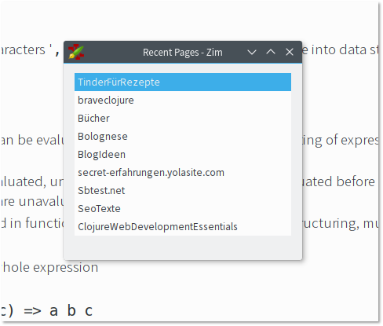

# recentpages
A Zim plugin, that schows you the recent visited pages in a popup window - similar to the pathbar.

This way you can hide the Path Bar in the View menu and still conveniently access your recent visited pages.

## Installation

Same as for the other plugins.

* [Download recentpages.py](https://raw.githubusercontent.com/rockiger/recentpages/master/recentpages.py)
* Put the recentpages.py into the plugins folder (%appdata%\zim\data\zim\plugins on Win, ~/.local/share/zim/plugins/ in Linux or Mac OS).
* to enable the plugin in Zim/Edit/Preferences/Plugins/ check mark Recent Pages.
* Type Ctrl+Shift+R and see if it's working.

This plugin is heavily based on the [Instantsearch plugin](https://github.com/e3rd/zim-plugin-instantsearch/blob/master/instantsearch.py). So go check it out.